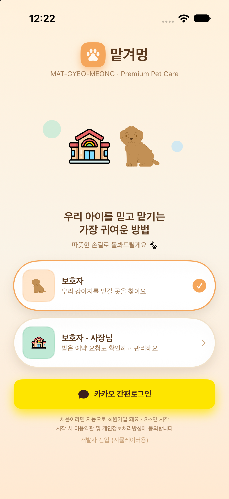
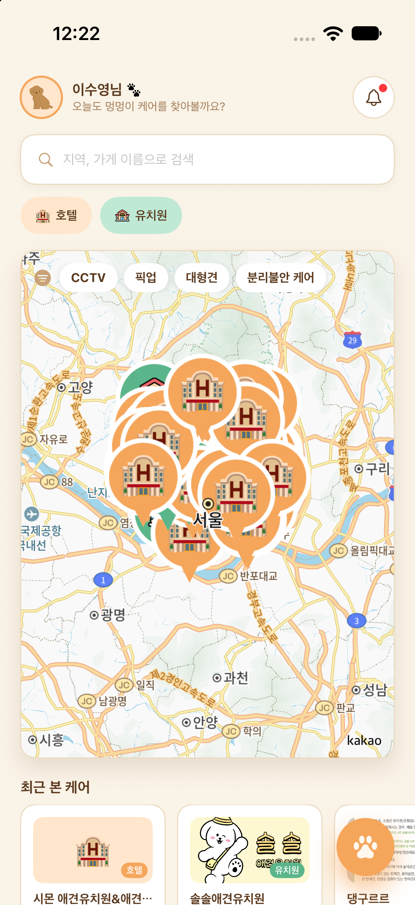
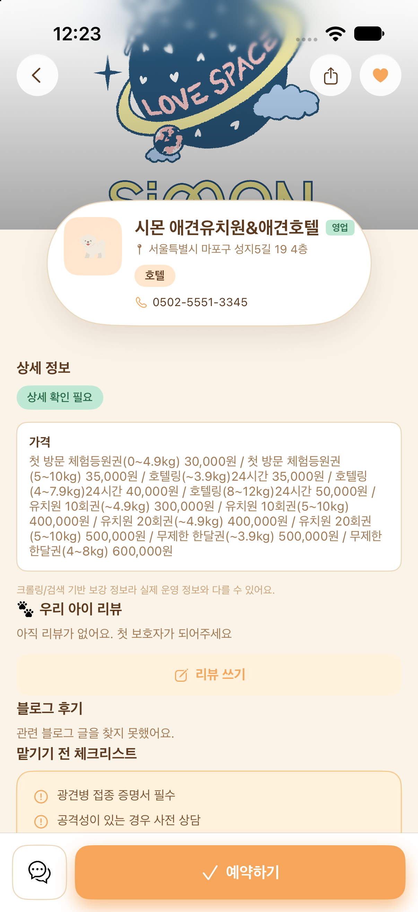
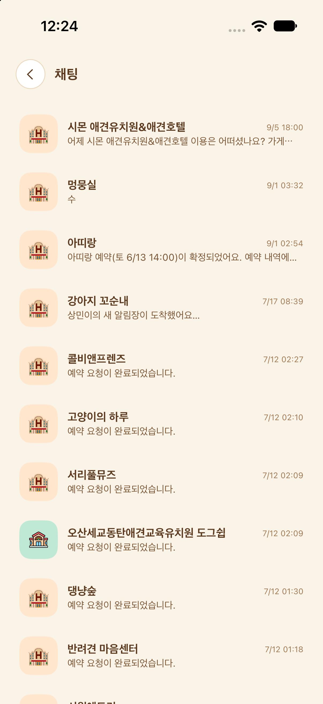
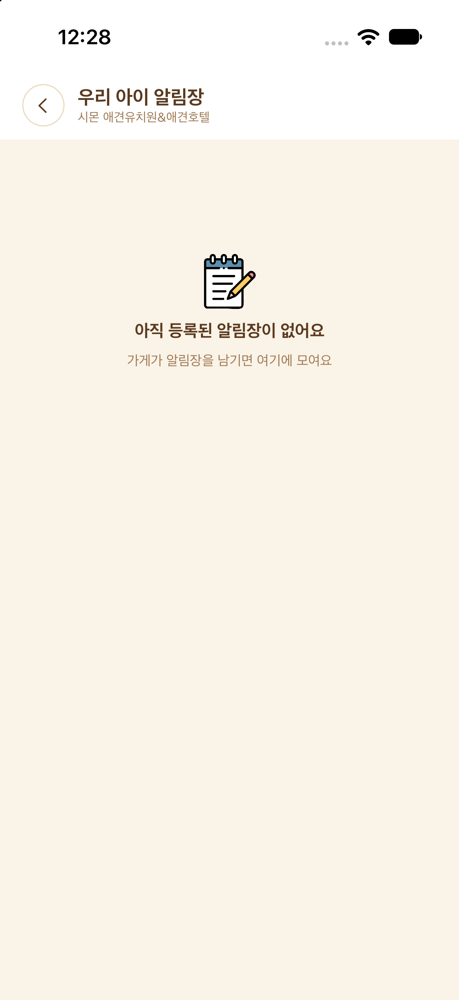
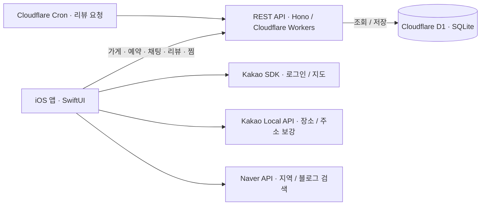

# 맡겨멍

반려견을 맡길 수 있는 애견 유치원·호텔을 지도 기반으로 탐색하고 예약하는 iOS 플랫폼입니다.
현재는 서울 지역의 애견 유치원·호텔을 카카오맵에서 찾고, 예약·채팅·알림장·리뷰·찜하기를 한 앱에서 이용할 수 있도록 개발하고 있습니다.

## 왜 만들었나

맡겨멍은 **애견 유치원·호텔을 찾는 과정과 이용 중 반려견의 일상을 확인하는 과정을 한 앱으로 연결하기 위해** 만들었습니다.

### 1. 유치원·호텔만 찾기 어려운 지도 검색

기존 지도 서비스에서 ‘강아지 유치원’을 검색했을 때, 주변 유치원이 일부만 검색되거나 강아지 미용실 등 다른 업종이 함께 표시되는 불편함을 경험했습니다. 유치원·호텔을 구분해 찾을 수 있는 필터가 충분하지 않아, 원하는 시설인지 검색 결과를 하나씩 확인해야 했습니다.

이 경험을 바탕으로 **반려견을 맡길 수 있는 유치원·호텔에 집중한 탐색 서비스**를 만들고자 했습니다.

### 2. 카카오톡으로 받던 알림장까지 한곳에서

시설에서는 당일 반려견의 식사·산책 등 돌봄 활동을 사진과 글로 정리해 카카오톡으로 보호자에게 보내는 경우가 많습니다. 이 알림장 기능을 앱으로 가져오면, 시설을 찾을 때와 이용 중 소식을 확인할 때 서로 다른 서비스를 오갈 필요가 줄어듭니다.

맡겨멍은 단순히 업체를 찾는 데 그치지 않고, **유치원·호텔 탐색부터 이용 중 알림장 확인까지 한 앱에서 이어지는 경험**을 제공하는 것을 목표로 합니다.

## 주요 기능

- **지도 기반 업체 탐색** — 서울 지역 유치원·호텔을 카카오맵에서 탐색합니다. 지역을 네모 버튼으로 선택하던 초기 디자인 대신 지도를 직접 보며 업체를 찾고, CCTV·픽업·대형견 등 조건으로 필터링합니다.
- **예약** — 날짜·서비스를 선택해 예약 신청. 예약과 동시에 업체와의 채팅방이 자동 생성됩니다.
- **실시간 채팅** — 보호자와 업체 간 1:1 채팅 (사용자+가게 조합당 채팅방 1개).
- **리뷰** — 실제 이용자가 남기는 펫 특화 리뷰(CCTV, 픽업, 대형견 가능 여부 등 태그 포함), 네이버 블로그 후기 연동.
- **찜한 가게** — 가게 상세에서 하트로 찜하고, 마이페이지에서 목록으로 모아보기.
- **카카오 로그인** — 프로필(이름·연락처·주소) 저장 및 수정.

## 실제 앱 화면

2026년 10월 1일 촬영한 개발 중인 앱 화면입니다. Figma 초기 디자인이 아니라 실행 중인 앱을 캡처했습니다. **가게 상세 정보는 계속 수정 중이므로 현재 버전과 다를 수 있습니다.** 화면 속 업체 정보·가격은 촬영 당시 표시된 내용이며, 최신 운영 정보를 보장하지 않습니다.

현재 앱은 **서울 지역 탐색 · 카카오맵 연동 · 카카오 로그인**을 기준으로 개발하고 있습니다. 초기 디자인의 전국 지역 선택 버튼과 네이버 로그인은 사용하지 않습니다.

| 시작 · 카카오 로그인 | 서울 지도 · 업체 탐색 | 가게 상세 (수정 중) |
| :---: | :---: | :---: |
|  |  |  |

| 업체별 채팅 목록 | 우리 아이 알림장 |
| :---: | :---: |
|  |  |

알림장 이미지는 **등록된 글이 없는 상태**입니다. 실제 돌봄 사진·글이 표시되는 화면은 추후 캡처로 보완할 예정입니다.

[예약 내역·반려견 등록 등 추가 화면 보기](docs/screenshots/README.md)

## 시스템 구조도



- **앱:** SwiftUI 화면에서 사용자 입력을 받고 APIClient·기능별 Service로 요청합니다. 외부 지도·검색 서비스는 앱에서 직접 호출하는 경로가 있습니다.
- **백엔드:** Workers의 Hono 라우트가 요청을 처리하고 D1에 가게·예약·채팅·리뷰·사용자 정보를 저장합니다.
- **현재 지도 데이터 경로:** `AnimalBoardingService` → `APIClient.fetchStores()` → `/api/stores` → D1에 저장된 업체 목록입니다. 초기 공공데이터 활용 설명과 현재 저장소의 조회 경로를 구분합니다.
- **예약 이후 흐름:** 예약 생성 시 채팅방을 연결하고, 예약 상태에 따라 Cron 작업이 리뷰 요청 메시지를 생성합니다. 채팅 API는 HTTP 기반이며 이 구조도는 별도 WebSocket 서버를 가정하지 않습니다.

## 구조

모노레포로 구성되어 있습니다.

```
Dog_kindergarden/       iOS 앱 (Swift, SwiftUI + Observation, iOS 16+)
backend-cloudflare/     백엔드 (TypeScript, Hono, Cloudflare Workers + D1)
docs/                   기획·진행상황·포트폴리오 문서
```

- iOS 앱 빌드는 [`Dog_kindergarden/README.md`](Dog_kindergarden/README.md) 참고
- 백엔드 배포는 [`backend-cloudflare/README.md`](backend-cloudflare/README.md) 참고
- 개발 계획·진행상황은 [`docs/PLAN.md`](docs/PLAN.md), [`docs/PROGRESS.md`](docs/PROGRESS.md) 참고

## 기술 스택

| 영역 | 기술 |
|---|---|
| iOS | Swift 5.9, SwiftUI, Observation, CocoaPods |
| 지도 | KakaoMapsSDK, 공공데이터 동물위탁관리업 API (TM→WGS84 좌표 변환 직접 구현) |
| 로그인 | 카카오 로그인 (KakaoSDKAuth/User) |
| 백엔드 | Hono, Cloudflare Workers |
| DB | Cloudflare D1 (SQLite) |
| 배포 | `https://matgyeomung-api.dog-kindergarden.workers.dev` |

## 배포 상태

포트폴리오 완성 후 App Store 출시까지 이어가는 것을 목표로 진행 중입니다. 현재 진행상황은 [`docs/PROGRESS.md`](docs/PROGRESS.md)에서 확인할 수 있습니다.
