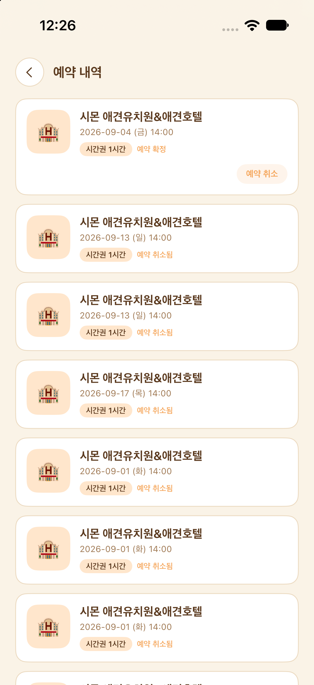
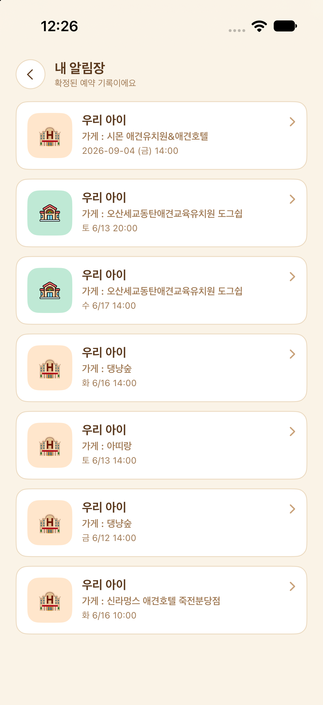
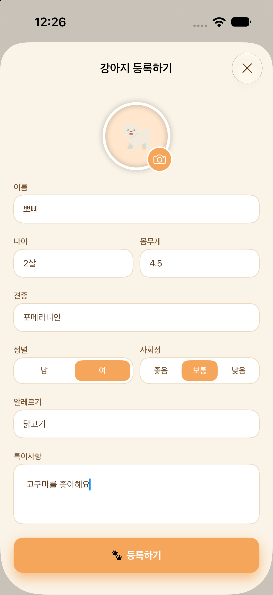
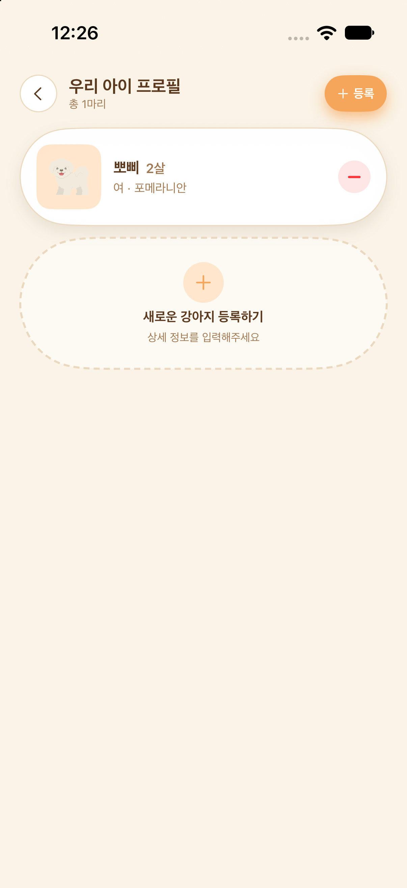
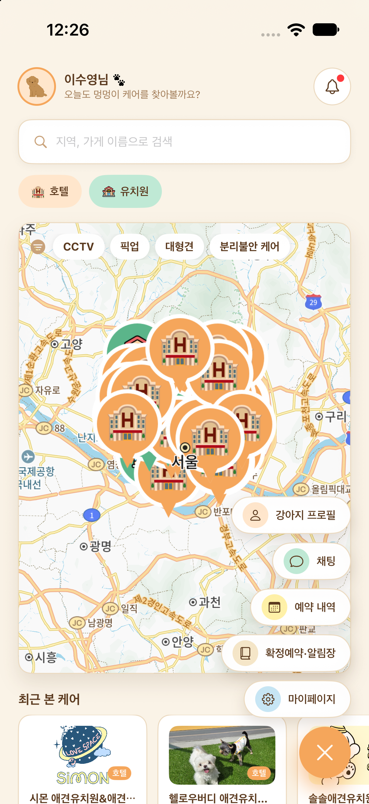

# 맡겨멍 실제 앱 화면

2026년 10월 1일 촬영한 개발 중인 앱입니다. 화면은 촬영 당시 기준이며, 특히 가게 상세 정보는 이후 변경될 수 있습니다. 아래 이미지는 기능 흐름을 보여주기 위한 자료이며 실제 서비스 이용 이력이나 운영 실적을 증명하는 자료는 아닙니다.

[프로젝트 소개로 돌아가기](../../README.md#실제-앱-화면)

## 예약·알림장

| 예약 내역 | 내 알림장 목록 |
| :---: | :---: |
|  |  |

## 반려견 등록·관리

| 반려견 등록 | 우리 아이 프로필 |
| :---: | :---: |
|  |  |

## 홈 바로가기 메뉴

## 이미지 관리

- 원본 화면을 수정하거나 Figma 디자인으로 대체하지 않았습니다.
- 개인 연락처·주소가 표시된 예약 입력 화면과 마이페이지 화면은 공개 자료에서 제외했습니다.
- 새 캡처를 반영할 때 같은 이름의 이미지 파일을 교체하고, 본 문서와 메인 README의 촬영 기준일·변경 안내를 함께 갱신합니다.
